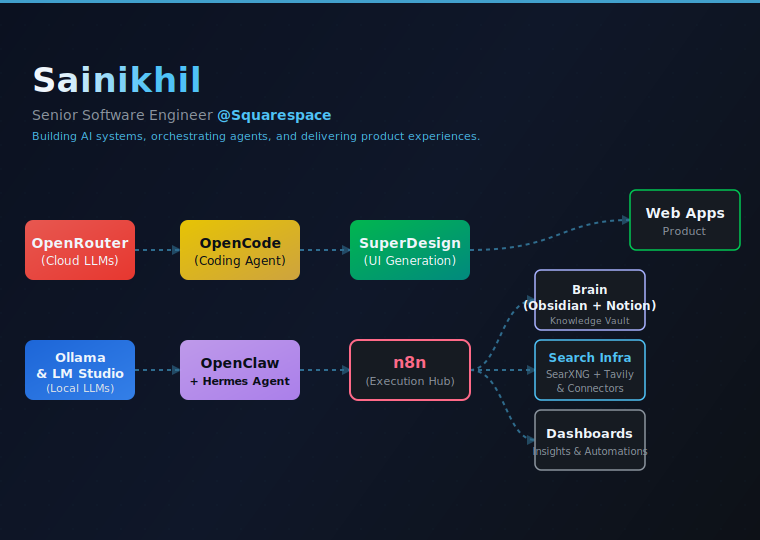

  

## I build product-first applications on deterministic foundations, accelerated by AI

I've shipped production apps in weather, QR infrastructure, and video tooling — each with serverless backends, real-time data, and cross-device support. I use AI as a tool in the stack, not a substitute for understanding the system.

### Featured work

| Project | What I built | Why it matters | Live |
| --- | --- | --- | --- |
| <a href="https://github.com/iamsainikhil/weather-react" target="_blank" rel="noopener noreferrer">weather-react</a>  | React 18 PWA with geolocation weather, 48h/8d forecasts, wind map, dynamic backgrounds, auto day/night theme, Sentry+LogRocket monitoring. | API proxy via Vercel serverless hides keys; Context API state (no Redux); survived Dark Sky → OpenWeather migration. |  |
| <a href="https://github.com/iamsainikhil/qr-canvas" target="_blank" rel="noopener noreferrer">qr-canvas</a>  | Full-stack QR platform (React+TS+Vite+shadcn) with 10 QR types, visual customization, dynamic redirects, scan analytics with geo/UTM tracking. | Editable QR after printing via Vercel Edge + Firestore; privacy-safe scan pipeline; fully self-hostable. |  |
| <a href="https://github.com/iamsainikhil/trimtube" target="_blank" rel="noopener noreferrer">trimtube</a>  | Next.js PWA that fetches YouTube videos/playlists, trims/loops client-side via IFrame API, manages playlists in localStorage with shuffle/sort/share. | Zero-server trimming — all in-browser via YouTube player API; recursive pagination handles 300+ videos; share links survive full page loads. |  |

### Currently shipping

- financial-os: Plaid-connected portfolio analysis, metals tracking, and retirement contribution planning with AI-assisted insights.
- LLM + agent orchestration via n8n: connecting cloud and local models, agents, and APIs into automated multi-step workflows.
- AI-powered dashboards aggregating data from Home Assistant, Bevel, TezLab, and other personal platforms into a unified view.

### Blog

Not actively writing. Follow me on  for updates on what I'm shipping & writing.

<!-- BLOG:START -->
<!-- BLOG:END -->

### Tech Stack & Tools

- **Next.js, React, TypeScript, Node.js** — full-stack apps, APIs, and PWAs with serverless backends.
- **Supabase, PostgreSQL, Firebase** — managed storage, auth, and real-time data layer.
- **Vercel, Docker** — deployment from serverless functions to containerized microservices.
- **Playwright** — CI-gated E2E testing across all shipped projects.
- **Ollama, LM Studio, WebLLM** — local LLM inference for privacy-sensitive agent workflows.
- **Opencode, Superdesign, Hermes Agent** — AI agents for coding, UI design, and repeatable engineering tasks.
- **Raycast** — custom launcher extensions and automation scripts.
- **Obsidian + Notion** — knowledge vault for research, notes, and cross-referencing across projects.
- **n8n** — workflow orchestration connecting APIs, LLMs, and data pipelines.

### 📊 GitHub Stats

<table>
  <tr>
    <td width="50%" align="center">
     
    </td>
    <td width="50%" align="center">
     
    </td>
  </tr>
</table>

<table>
  <tr>
    <td width="50%" align="center">
     
    </td>
    <td width="50%" align="center">
     
    </td>
  </tr>
</table>

<table>
  <tr>
  <td width="50%" align="center">
      
    </td>
    <td width="50%" align="center">
      
    </td>
  </tr>
</table>

### Connect

Outside code, I shoot candid, landscape, and urban photography on <a href="https://gurushots.com/iamsainikhil/photos" target="_blank" rel="noopener noreferrer">GuruShots</a>.

  
  
  

