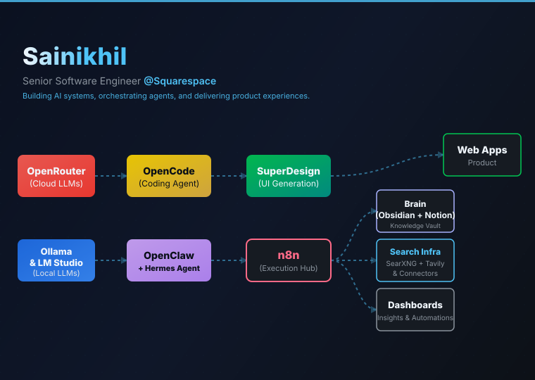

  

  

I build product-first applications on deterministic foundations, accelerated by AI. I lean on serverless architecture, keep state management simple, and treat AI as a tool I control, not one that controls me.

  
  
  
  
  

  
  
  <a href="https://github.com/DenverCoder1/Simple-View-Counter">
  

### Featured work

| Project                                                                                                             | What I built                                                                                                                                                                                                 | Why it matters                                                                                                                                                       | Live                                                                                                                                                                                                |
| ------------------------------------------------------------------------------------------------------------------- | ------------------------------------------------------------------------------------------------------------------------------------------------------------------------------------------------------------ | -------------------------------------------------------------------------------------------------------------------------------------------------------------------- | --------------------------------------------------------------------------------------------------------------------------------------------------------------------------------------------------- |
| <a href="https://github.com/iamsainikhil/weather-react" target="_blank" rel="noopener noreferrer">weather-react</a> | React 18 PWA with geolocation weather, 48h/8d forecasts, wind map, dynamic backgrounds, auto day/night theme, Sentry+LogRocket monitoring.                                                                   | Started as a React learning project, outlived both Dark Sky and Algolia Places shutting down. No Redux, no overengineering, just Context API and serverless proxies. |  |
| <a href="https://github.com/iamsainikhil/trimtube" target="_blank" rel="noopener noreferrer">trimtube</a>           | Next.js PWA that fetches YouTube videos/playlists, trims/loops client-side via IFrame API, manages playlists in localStorage with shuffle/sort/share.                                                        | Paste a YouTube link to trim and loop any video client-side via the IFrame API. Playlists stay in your browser with shuffle, sort, and share links that survive full reloads.                     |                    |
| <a href="https://github.com/iamsainikhil/qr-canvas" target="_blank" rel="noopener noreferrer">qr-canvas</a>         | Next.js QR builder with Firestore backend. 10 QR types, rich visual customization (colors, shapes, logos, scan labels), dynamic redirects via API routes, and per-code scan analytics with geo/UTM tracking. | Change a printed QR's destination anytime. Full scan analytics without selling user data. A free, self-hostable alternative to paid QR services that charge $20+/mo. |                    |

### Currently shipping

- financial-os: Plaid-connected portfolio analysis, metals tracking, and retirement contribution planning with AI-assisted insights.
- LLM + agent orchestration via n8n: connecting cloud and local models, agents, and APIs into automated multi-step workflows.
- AI-powered dashboards aggregating data from Home Assistant, Bevel, TezLab, and other personal platforms into a unified view.

### Blog

  

<!-- BLOG:START -->
- <a href="https://blog.iamsainikhil.com/article/build-a-blog-using-nextjs-and-prismic" target="_blank" rel="noopener noreferrer">Build a Blog using NextJS & Prismic</a>
- <a href="https://blog.iamsainikhil.com/article/serverless-functions-vercel" target="_blank" rel="noopener noreferrer">Serverless Functions on Vercel</a>
- <a href="https://blog.iamsainikhil.com/article/prismic-webhooks" target="_blank" rel="noopener noreferrer">Prismic Webhooks</a>

  
More articles

  <ul>
    <li><a href="https://blog.iamsainikhil.com/article/build-a-blog-using-gatsby-and-prismic" target="_blank" rel="noopener noreferrer">Build a Blog using Gatsby & Prismic</a></li>
    <li><a href="https://blog.iamsainikhil.com/article/themes-using-theme-ui" target="_blank" rel="noopener noreferrer">Build custom themes using Theme UI</a></li>
    <li><a href="https://blog.iamsainikhil.com/article/weather-react-app" target="_blank" rel="noopener noreferrer">Build a Weather Application Using React</a></li>
  </ul>

<!-- BLOG:END -->

<h3>🛠️ Tech Stack & Tools</h3>

  <h4>Frontend</h4>
  

    
    
    
    
    
    
  

  <h4>Frameworks</h4>
  

    
    
    
    
    
  

  <h4>Backend & API</h4>
  

    
    
    
    
    
  

  <h4>Database</h4>
  

    
    
    
    
  

  <h4>DevOps</h4>
  

    
    
    
    
    
    
  

  <h4>AI Tools</h4>
  

    
    
    
    
    
  

  <h4>Search & Retrieval</h4>
  

    
    
  

  <h4>Knowledge Vault</h4>
  

    
    
  

  <h4>Workflows & Automations</h4>
  

    
    
    
  

  <h3>📊 GitHub Stats</h3>

  

    
  

  
    <table>
    <tr>
      <td width="50%" align="center">
        
      </td>
      <td width="50%" align="center">
        
      </td>
    </tr>
  </table>
  <table>
    <tr>
      <td width="50%" align="center">
        
      </td>
      <td width="50%" align="center">
        
      </td>
    </tr>
  </table>

  <h4>⚡ Recent GitHub Activity</h4>

  <!--START_SECTION:activity-->
1. 🔀 Opened PR [#477](https://github.com/DenverCoder1/readme-typing-svg/pull/477) in [DenverCoder1/readme-typing-svg](https://github.com/DenverCoder1/readme-typing-svg)
2. 🚀 Published release [v2.1.1](https://github.com/iamsainikhil/qr-canvas/releases/tag/v2.1.1) in [iamsainikhil/qr-canvas](https://github.com/iamsainikhil/qr-canvas)
3. 🎉 Merged PR [#6](https://github.com/iamsainikhil/qr-canvas/pull/6) in [iamsainikhil/qr-canvas](https://github.com/iamsainikhil/qr-canvas)
4. 🏷️ Labeled PR [#6](https://github.com/iamsainikhil/qr-canvas/pull/6) in [iamsainikhil/qr-canvas](https://github.com/iamsainikhil/qr-canvas)
5. 🔀 Opened PR [#6](https://github.com/iamsainikhil/qr-canvas/pull/6) in [iamsainikhil/qr-canvas](https://github.com/iamsainikhil/qr-canvas)
  <!--END_SECTION:activity-->
